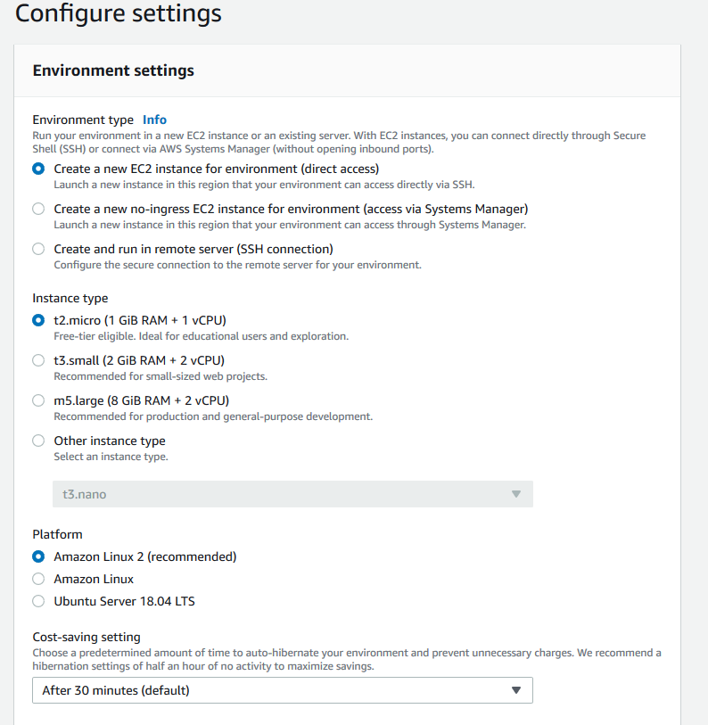
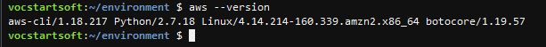
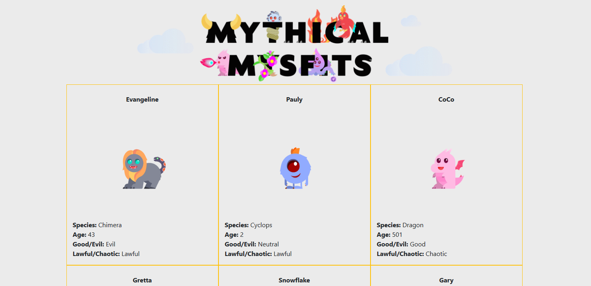
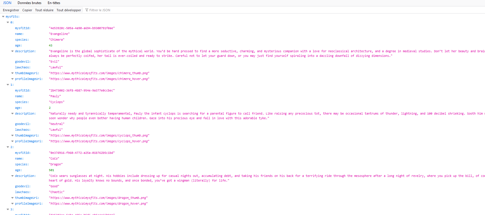

# AWS TD2 : Utilisation de la CLI AWS

Dans ce TD vous allez apprendre à utiliser la CLI AWS afin de déployer divers services. Cela peut permettre d'automatiser la création et la maintenance d'infrastructure, car une CLI est scriptable. Ce TD est largement repris des modules de tutoriels d'AWS : https://aws.amazon.com/fr/getting-started/hands-on/build-modern-app-fargate-lambda-dynamodb-python/

## Modélisation 

Avant de commencer ce TD, vous allez modéliser une architecture pour une application web, front et back séparé, base de donnée. Le but est d'avoir une architecture qui assure : 

* Elasticité
* Traçabilité
* Auditabilité
* Détection d'intrusion
* Gestion des cycles de vie
* Gestion des droits
* Gestion du chiffrement

Indiquer les services que vous utiliserez et pourquoi.

## Mise en place de l'environnement

Ici nous allons utiliser l'environnement de développement AWS. Comme vous n'avez pas le droit de créer des clès de programmation AWS, vous allez devoir utiliser Cloud9, un service d'IDE AWS qui tourne sur une instance EC2 et fournis divers outils de programmation telle que la CLI.
Créer un nouvel environnement AWS, sélectionner la taille d'instance la plus petite. 

Vous avez ensuite accès à un IDE avec un terminal avec les droits admin lorsque vous faites sudo (pas de mot de passe). Vérifier que la CLI est bien installé.

## Le projet : Déploiement d'une application web légère

Clonner le projet github suivant : 

``git clone -b python https://github.com/aws-samples/aws-modern-application-workshop.git``

### Partie 1 : hébergement front-end : fichiers statique

Pour le déploiement du front-end, nous allons utiliser un bucket S3 qui servira à distribuer les fichiers statiques. Pour ce faire, créer un nouveau bucket S3 :

``aws s3 mb s3://mymisticalbucket1``

Ensuite, il faut indiquer à votre bucket qu'il distribuera des fichiers statiques. Pour ce faire, il faut lui indiquer un document d'index, puis modifier la politique du bucket. 

``aws s3 website s3://mymisticalbucket1 --index-document index.html``

La politique du bucket est fournie dans le projet github, module-1/aws-cli/website-bucket.json. Bien entendu à vous de la modifier pour qu'elle corresponde à votre bucket.

*Question : Qui peut faire quoi avec cette policy ?*

Ensuite éxécuter la commande suivante pour attribuer la bucket policy à votre bucket : 

``aws s3api put-bucket-policy --bucket mymisticalbucket1 --policy file://~/environment/aws-modern-application-workshop/module-1/aws-cli/website-bucket-policy.json``

Ajouter le contenu du site web statique sur votre bucket. 

`` aws s3 cp ~/environment/aws-modern-application-workshop/module-1/web/index.html s3://mymisticalbucket1/index.html ``

Aller sur l'URL de votre application pour vérifier que tout fonctionne : 

http://mymisticalbucket1.s3-website-us-east-1.amazonaws.com

*Question : Pouvez vous mettre en place du https ? Expliquez pourquoi.*

### Partie 2 : hébergement du backend

Ici nous allons déployer le back-end de l'application pour la rendre dynamique. Pour ce faire, nous utiliserons AWS ECS Fargate car il permet de s'affranchir de la gestion des systèmes d'exploitation. Attention Fargate est plus cher que l'utilisatoin d'EC2. Pensez à bien kill vos services une fois terminé, où lorsque vous n'en avez pas besoin.

Nous allons aussi utiliser une Network Load Balancer pour gérer la répartition du traffic au seins des serveurs Fargate.

#### Création du back-end avec flask et Docker

Aller dans le dossier module-2/app. Créer l'image docker, puis le repo ECR pour la stocker. 

``docker build . -t REPLACE_ME_AWS_ACCOUNT_ID.dkr.ecr.us-east-1.amazonaws.com/mythicalmysfits/service:latest``

``aws ecr create-repository --repository-name mythicalmysfits/service``

*Question : Le repository que vous venez de créer est-il chiffré ? Les images poussées sont elles analysées ?*

*Question : effectuer une analyse de vulnérabilité sur votre image Docker, est-elle sure ?*

Logger vous sur votre repo ECR : 
``$(aws ecr get-login --no-include-email)``

Pousser l'image : 

``docker push REPLACE_ME_WITH_DOCKER_IMAGE_TAG``

#### Mise en place des ressources de bases

Maintenant, il va falloir utliser le template CloudFormation. Cependant, à cause des restrictions (à la con) de AWS Educate, il va falloir changer le template fournis. Commencer par supprimer tout ce qui a attrait au réseau (VPC, NAT etc). Pour le SG de fargate, faite un openWorld. Supprimer le endpoint DynamoDB.

``aws cloudformation create-stack --stack-name MythicalMysfitsCoreStack --capabilities CAPABILITY_NAMED_IAM --template-body file://~/environment/aws-modern-application-workshop/module-2/cfn/core.yml``

*Question : Analyser le fichier CloudFormation, combiens de rôles IAM sont créés, que permettent-ils à qui/quoi ?*

#### Création de la task 

Maintenant, nous allons passer à la création du cluster ECS qui contiendra nos task Fargate. 

``aws ecs create-cluster --cluster-name MythicalMysfits-Cluster``

Créer ensuite un log groupe. Cela permettra de pouvoir recevoir et analyser les logs du service. 

``aws logs create-log-group --log-group-name mythicalmysfits-logs``

Maintenant, il faut définir une task ECS, qui correspond à l'ensemble des container Dockers qui devront s'exécuter. La task permet aussi de définir les ressources pour chaque container, leurs variables d'environnements etc.

Ici aussi le fichier json qui permet de définir la task est fournis  par le projet. C'est le fichier task-definition.json dans le dossier aws-cli. Modifier le fichier pour avoir les bons ARN. 

Puis enregistrer la Task : 

``aws ecs register-task-definition --cli-input-json file://~/environment/aws-modern-application-workshop/module-2/aws-cli/task-definition.json``

#### Création du load Balancer

Nous allons mainteant mettre en place le load balancer. Selectionner deux sous réseaux public dans deux AZ différentes. 

``aws elbv2 create-load-balancer --name mysfits-nlb --scheme internet-facing --type network --subnets subnet-07981632572604488 subnet-01e109cb37bec9354 > ~/environment/nlb-output.json``

Esnuite créer le target groupe du NLB :

``aws elbv2 create-target-group --name MythicalMysfits-TargetGroup --port 8080 --protocol TCP --target-type ip --vpc-id vpc-f324858e --health-check-interval-seconds 10 --health-check-path / --health-check-protocol HTTP --healthy-threshold-count 3 --unhealthy-threshold-count 3 > ~/environment/target-group-output.json``

Ensuite créer le listener du NLB : 

``aws elbv2 create-listener --default-actions TargetGroupArn=arn:aws:elasticloadbalancing:us-east-1:242763219812:targetgroup/MythicalMysfits-TargetGroup/fda52a08c420b8db,Type=forward --load-balancer-arn arn:aws:elasticloadbalancing:us-east-1:242763219812:loadbalancer/net/mysfits-nlb/2144cfab34a49acd --port 80 --protocol TCP``

#### Création du service Fargate :

Tout d'abord il faut créer un rôle pour autoriser le service Fargate à effectuer certaines actions sur le compte : 

``aws iam create-service-linked-role --aws-service-name ecs.amazonaws.com``

Ensuite nous pouvons créer le service Fargate. La définition de ce dernier se trouve dans le fichier service-definition.json. Modifiez le pour ajouter les bonnes valeurs. Pour les subnets, mettez deux subnet public, vérifiez que l'attribution d'adresse IP publiques est bien activé (Et on dit merci qui ?). Puis enregistrer la définition du service : 

``aws ecs create-service --cli-input-json file://~/environment/aws-modern-application-workshop/module-2/aws-cli/service-definition.json``

Ensuite essayer de comuniquer avec NLB en appelant son DNS. Vous devriez recevoir un json. (/mysfits pour le json des créatures)

#### Liaison BAck-end - Front-end

Pour faire en sorte que notre front-end appel notre back-end, il faut modifier le fichier index.html que nous avons placé dans notre bucket S3. Ajouter la variable mysfitsApiEndpoint dans le script angular et changer la pour l'url de votre back-end. 

Retourner sur l'url du bucket et voyez que ça fonctionne toujours.

### Mise en place du CI/CD

Pour faciliter nos déploiements et l'intégration de nouveau code, nous allons mettre en place une pipeline CI/CD avec les outils AWS CodeCommit, CodePipeline et Codebuild. 

Pour se faire, créer un nouveau bucket S3 qui servira à stocker vos artefacts : 

``aws s3 mb s3://mysticals-artifacts-bucket-1``

Ensuite attribuer lui une stratégie IAM afin de faire en sorte que seule notre pipeline puisse y avoir accès. Modifiez la stratégie artifacts-buckets.json.

*Question : avec cette stratégie, qui à le droit de faire quoi ?*

``aws s3api put-bucket-policy --bucket mysticals-artifacts-bucket-1 --policy file://~/environment/aws-modern-application-workshop/module-2/aws-cli/artifacts-bucket-policy.json``

Créer ensuite votre repos CodeCommit : 

``aws codecommit create-repository --repository-name MythicalMysfitsService-Repository``

Modifier ensuite le json du projet codecommit afin de lui donner les bons droits. Puis créer le projet : 

``aws codebuild create-project --cli-input-json file://~/environment/aws-modern-application-workshop/module-2/aws-cli/code-build-project.json``

Maintenant, nous allons créer la pipeline, qui effectuera le build de notre application, l'update de l'image docker et la mise à jour du cluster ECS à chaque nouveau push sur le repo CodeCommit. Modifier donc le fichier code-pipeline.json. 

``aws codepipeline create-pipeline --cli-input-json file://~/environment/aws-modern-application-workshop/module-2/aws-cli/code-pipeline.json``

Enfin, modifier le fichier ecr-policy.json puis mettre à jour le repo ECR.

``aws ecr set-repository-policy --repository-name mythicalmysfits/service --policy-text file://~/environment/aws-modern-application-workshop/module-2/aws-cli/ecr-policy.json``

*Question pourquoi mettre à jour la policy du repo ECR ?*

Tester votre pipeline en effectuant un push sur votre repo code commit. 
``git config --global credential.helper '!aws codecommit credential-helper $@'``

``git config --global credential.UseHttpPath true``

Cloner votre repo CodeCommit, ajouter le code de l'application et push.

git clone https://git-codecommit.us-east-1.amazonaws.com/v1/repos/MythicalMysfitsService-Repository

Patienter environ 5-10min le temps que la pipeline s'exécute au complet.
Vous pouvez suivre l'évolution dans la console AWS.

### Mise en place de la base de donnée NoSQL

Pour cette application, une base de données no  SQL est suffisante. Ainsi on va utiliser DynamoDB. Pour ce faire, créer une table avec le json fournis dans le module 3. 

``aws dynamodb create-table --cli-input-json file://~/environment/aws-modern-application-workshop/module-3/aws-cli/dynamodb-table.json``

Ajouter des éléments dans la table avec l'autre json fournis : 

``aws dynamodb batch-write-item --request-items file://~/environment/aws-modern-application-workshop/module-3/aws-cli/populate-dynamodb.json``

Vérifier que les élèments ont biens été ajoutés : 

``aws dynamodb scan --table-name MysfitsTable``

ajouter le nouveau code python dans votre repo afin de pouvoir utiliser une connexion à la DynamoDB : 

``cp ~/environment/aws-modern-application-workshop/module-3/app/service/* ~/environment/MythicalMysfitsService-Repository/service/``

Mettez à jour le fichier index.html du module 3 (chercher les chaines REPLACE_ME) puis mettez à jour le bucket s3 :

``aws s3 cp --recursive ~/environment/aws-modern-application-workshop/module-3/web/ s3://your_bucket_name_here/``

Observer que votre application fonctionne toujours.
Rajouter un nouveau monstre dans la base dynamoDB et observer.

*Question Final : Mettez en place une distribution CloudFront avec du HTTPS*

*Bonus:  Si il vous reste du temps, vous pouvez faire les modules 4 et 5 tout en décrivant ce que vous faites.*

https://aws.amazon.com/fr/getting-started/hands-on/build-modern-app-fargate-lambda-dynamodb-python/module-four/

N'oubliez pas de nettoyer votre compte AWS lorsque vous avez terminé !
